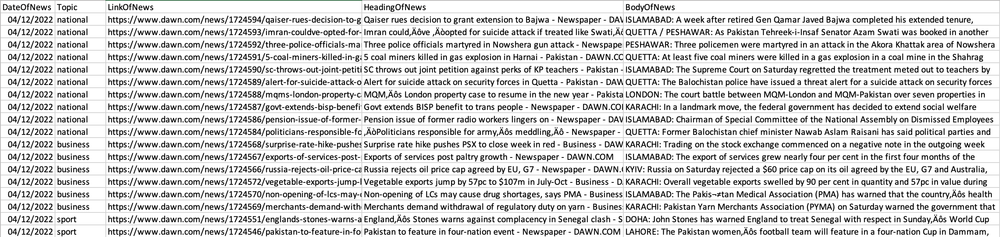

# Dawn News Scapper

This scapper can be used to easily fetch the dawn news data for the selected days, and the results will be store in an CSV file, along with date, topic, link, title and body. 


## Motivation

MS research work for Time-series based Fake news analysis


## Running instructions

The number of day's variable will get the previous day's news.
```
NUMBER_OF_DAYS = 200
```

Custom Topics can be added by changing the list of baseURL's
```
baseURLList=["https://www.dawn.com/newspaper/national/","https://www.dawn.com/newspaper/business/", "https://www.dawn.com/newspaper/sport/"]
```

That's it, after execution the dataset will be created, tehre is a delay added in to handle the connection limit from Dawn news.


